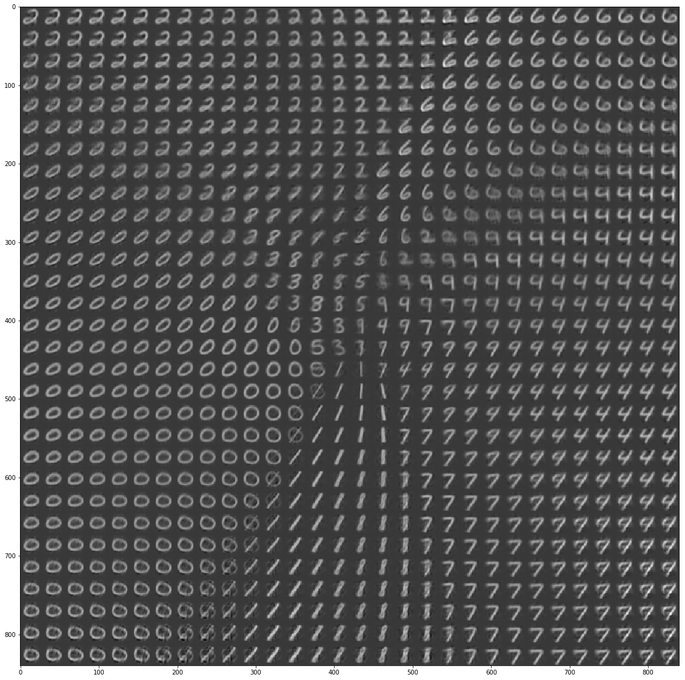

Tensorflow 2.0 VAE implementation
---

The VAE.py file contains a VAE implementation with a normal distribution as latent distribution and one dirichlet. 


Normal 
---

The normal distribution appears to be the most common one, it lets us map our data onto a lower dimensional spherical thing.


We can visualize how the images look in different regions of this space.
<p align="center">

</p>

Dirichlet
---

The dirichlet distribution is interesting because we can map data to lower dimensional categories. For example images! The following code trains a dirichlet VAE and then plots what it believes are the best representation of all the digits.

```python
import vae
import tensorflow as tf

categories = 10
smoothness = 0.5

encoder, decoder = vae.dense_encoder_decoder_dirichlet(data_dim, 
                                             latent_dim=categories, 
                                             layers=4, 
                                             hidden_units=128, 
                                             activation=tf.nn.relu)

v = vae.DIRICHLET_VAE(encoder, decoder, smoothness=smoothness, categories=categories,
                     alpha_smoothing=0.1, label_smoothing=8)

v.fit(mnist_data, mnist_labels, batch_size=64, epochs=30)

onehots = np.eye(10)[np.arange(10)]
images = v.map_from_latent(onehots).numpy()
plt.figure(figsize=(20, 20))
for i in range(5):
    plt.subplot(5, 2, i * 2 + 1)
    plt.imshow(images[i * 2].reshape(im_sz, im_sz))
    plt.subplot(5, 2, i * 2 + 2)
    plt.imshow(images[i * 2 + 1].reshape(im_sz, im_sz))

plt.show()

``` 

<p align="center">

</p>


It is also possible to blend categories. Here's a 50% 0 and 50% 1

```python

image = np.zeros(10)
image[0] = 0.5
image[1] = 0.5

image = image.reshape(1, 10)
image = v.map_from_latent(image).numpy()

plt.figure(figsize=(10, 6))
plt.imshow(image.reshape(im_sz, im_sz))
plt.savefig("dirichlet_blend.png", bbox_inches="tight")
plt.show()

```

<p align="center">

</p>


See the notebook for the code used to make these examples.
